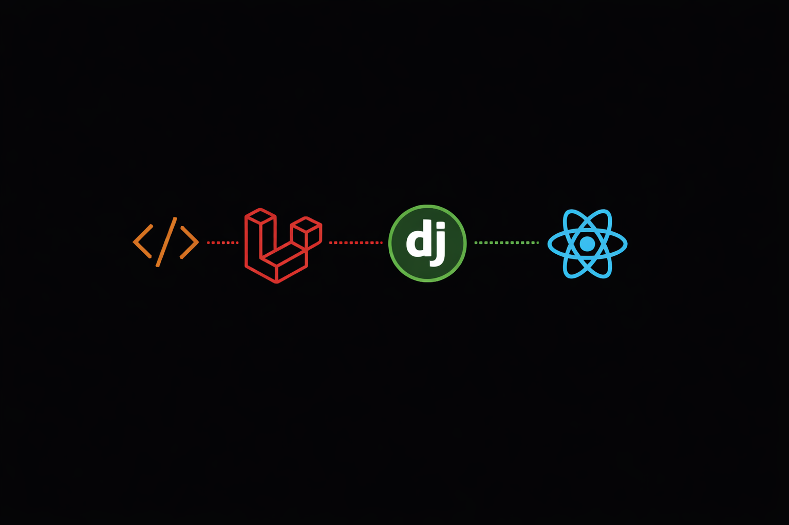

  
  
  

## 🚀 About Me
Full Stack Developer specializing in web and mobile application development. I build scalable solutions across the entire stack - from responsive web apps to native mobile experiences.

- 💻 **Web Development:** React, Angular, Vue.js
- 📱 **Mobile Development:** React Native, Flutter, iOS/Android
- ⚙️ **Backend Systems:** Node.js, NestJS, Laravel, Django
- 🔄 **Database & Cloud:** PostgreSQL, MongoDB, AWS, GCP, Docker

## 💻 Tech Stack

  

---

## 🏆 GitHub Stats

  

  
  

  

---

## 📫 Let's Connect

  
💼 Open for collaboration | 📧 Professional opportunities | 🤝 Connect with fellow developers

